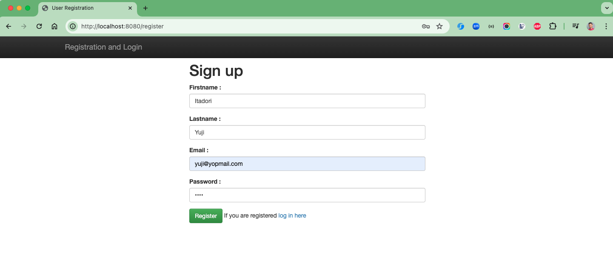
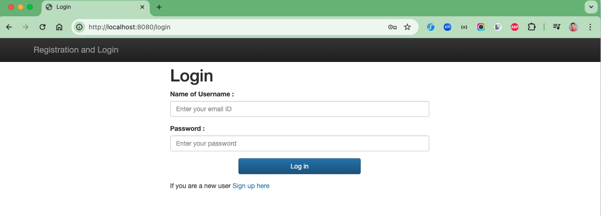
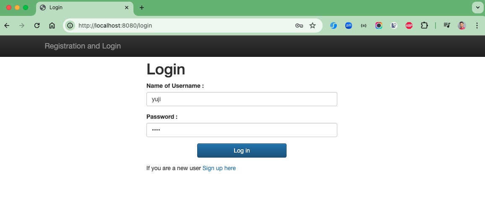
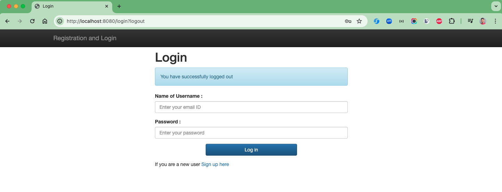

# spring-boot-user-registration

### Things todo list

1. Clone this repository: `git clone https://github.com/hendisantika/spring-boot-user-registration.git`
2. Navigate to the folder: `cd spring-boot-user-registration`
3. Run the application: `mvn clean spring-boot:run`
4. Open your favorite browser: http://localhost:8080

### Image Screenshot

SignUp Page

Login Page

List All users Page

Logout Page

